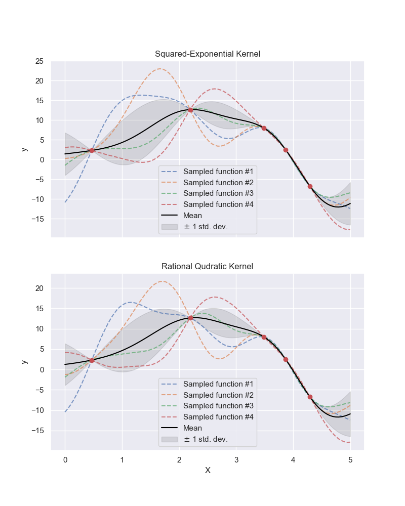

# Introduction to Gaussian Process Regressors and Their Implementation
The following directory contains the Python scripts and figures that supplement the Medium post on Gaussian Process Regression: <https://medium.com/@patricksandovalromero/a-brief-introduction-gaussian-process-regression-5298613f6595>. The script `Gaussians.py` defines function for plotting multivariate normal distributions and plots a bivariate normal distribution through a surface plot, countour plot and its marginal distributions. The script `Kernels.py` defines kernels often found in literature such as the squared exponential also known as radial basis function, rational quadratic and sine squared exponential. The script plot their corresponding covariance matrix and their covariance for X=0. Lastly the script `Compare.py` generates synthetic data through a hidden function and compares the predictions two GPRs one defined with a RBF kernel and the other defined with a RQF kernel. 

### Bivariate Normal Distributions
In order to undertand GPRs we need a strong undertanding of multivariate normal distributions, or at least how correlation between variables helps constrain them. In the plot generated by the `Gaussian.py` script we see how the correlation bewteen X and Y affect the shape of the marginal distributions of X and Y. If we create a Kernel that is sensitive to the distance between points then we are ensuring the points are connected in a smooth manner, so when we sample from a MVN that uses such kernels then all the points samples will follow a smooth continuous function.

    

### Sampling from two different MVNs with different kernels
The script `Compare.py` uses two very common kernels for defining two GPRs and compares their predictions against each other. The main difference betweem these kernels is the rate of decrease of the covariance per unit distance. The RBF drops the covariance value at a faster rate than the RQF kernel. As seen in the covariance matrix plots generated by `Kernels.py`. 

    

After training each model to the observations we notice a strong similarity in hyperparameters and r-square value however, the RQF model has a higher log-likelihood than the RBF model thus suggesting this model is a better representation of the data.

    

For further discussion of these results please refer to the Medium post.

