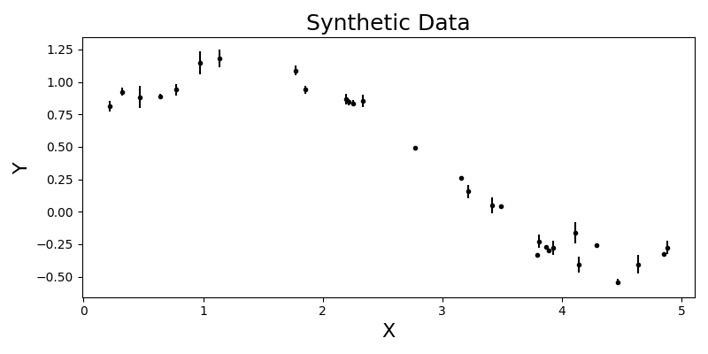

# Modelling Data with Maximum Likelihood Estimation and Non-Linear Least Squares
The following directory contains the python script for synthetically generating data using a sinusoidal model function and adding noise to the data. The script also performs a non-linear leas-squares routine to find the optimal parameters that minimize the square error, assuming the parameter error is Gaussian. The script also usese a markov-chain monte-carlo method to sample the posterior distribution of the model parameters allowing us to find the parameters with highest likelihood. 

### Synthetically Generating Data
Because we are comparing two modelling techinques it is beneficial for us to know what the true nature of the data is. For this purpose alone I chose to generate my own data instead of querying some external dataset.

    

### Non-Linear Least-Squares and Maximum Likelihood Estimate
One of the most common techniques used to run a least-square fitting rountine is by using `scipy.optimize.curve_fit` function, which is uses `scipy.optimize.minimize` to minimize the square error between the observed and theoretical data. Additionally, to implement the Maximum Likelihood Estimate I used the `emcee` library to sample the posterior distributions. However, since this can be a computationally expensive task I also used `multiprocessing.Pool` to parallelize the routine and reduce runtime significantly.

|||
|--------------------------|--------------------------|
| !Non-Linear Least-Square Fit | !MCMC Maximum Likelihood Esimate Fit|

### Conclusions
The empirical fit of MLE is better than the fit provided by LS, however, we need to be cautios of how we implement MCMC MLE's for data modelling as they are very sensitive to models. Therefore, if the model is not accurate enough then the MLE fit will fail every time.